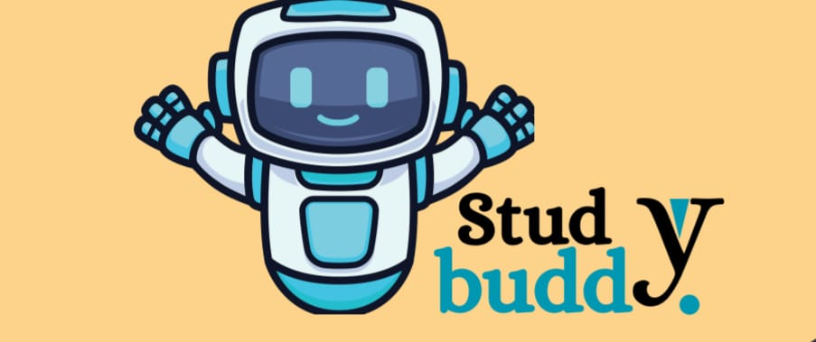

📚 Study Buddy
Study Buddy is a student-focused web platform designed to provide everything a student needs in one place — from learning resources to peer-to-peer tutoring and skill exchange.

🚀 Features

🔍 Search Functionality – Easily search for study materials and services

📖 Buy & Sell Books – Exchange textbooks and academic resources

🎓 Peer Tutoring – Learn from fellow students who excel in subjects

🎨 Skill Exchange – Trade knowledge (e.g., academics ↔ arts/music)

📢 Student Services Hub – All-in-one platform for academic needs

🎯 Target Users

Students who want to learn from peers

Learners looking for flexible, online education

Users who prefer a single platform instead of multiple websites

📊 Business Overview
💡 Revenue Sources

In-app purchases

Subscription plans

Advertising and promotions

💰 Financial Highlights

Estimated Revenue: ₹20,00,000

Major income from advertising and subscriptions

📈 Goals
Short-Term

Reach 1000+ users

Generate initial revenue

Mid-Term

Expand across India

Improve features and user experience

Long-Term

Introduce offline learning sessions

Build a global student network

Collaborate with companies and institutions

🧠 SWOT Analysis
Strengths

One-stop platform for students

Unique peer-to-peer learning concept

Weaknesses

New platform (trust-building required)

Competitive market

Opportunities

Growing demand for online learning

Skill-sharing ecosystem

Challenges

Security concerns

User trust and adoption

🛠️ Technologies Used

HTML5

CSS3

Google Fonts (Material Symbols)

📷 Preview

Add a screenshot of your webpage here (optional)
Example:

⚙️ How to Run

Download or clone the repository

Open the project folder

Run the index.html file in any browser

🤝 Contributors

Team of 5 partners

Equal investment and profit sharing

📌 Future Enhancements

User login system

Payment gateway integration

Real-time chat between students

Mobile app version

📄 License
This project is for educational purposes.
